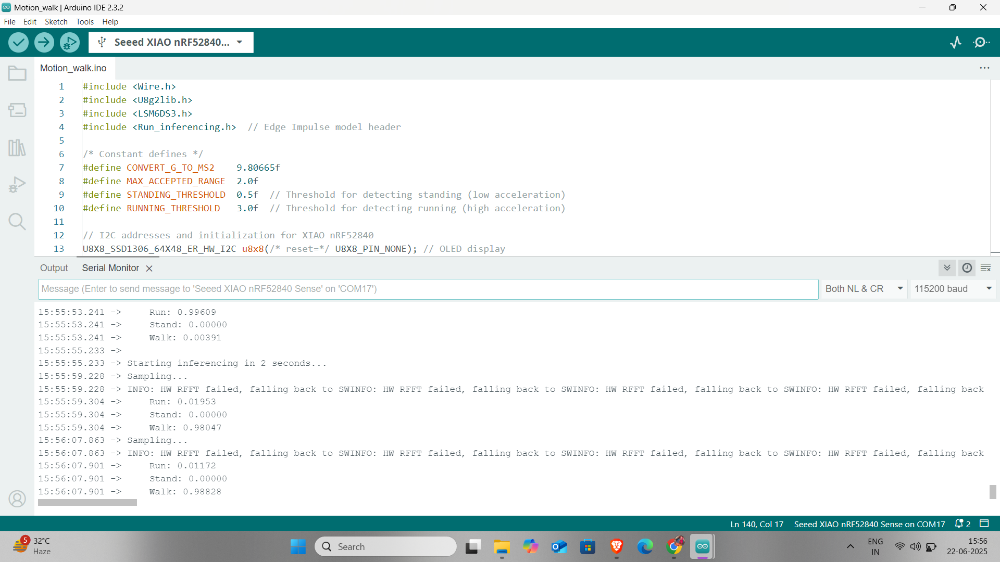

# Edge AI Motion Tracker

A smart motion tracker using the Seeed XIAO nRF52840 Sense and Edge Impulse.  
It classifies human movements like standing, walking, or running using onboard IMU sensors and a trained machine learning model.

## Features

- Real-time motion recognition
- Edge ML inference (no cloud needed)
- Built with Edge Impulse
- USB Serial Output for motion result

## How it Works

1. Collect motion data using onboard 6-axis IMU
2. Train model using Edge Impulse
3. Export and deploy the model
4. Run classification in real-time on the XIAO board

## Hardware Used

- Seeed XIAO nRF52840 Sense
- USB cable for programming and power

## Installation

1. Open the `firmware/edge_ai_motion_tracker.ino` file in Arduino IDE
2. Make sure you have installed:
   - **Seeed nRF52 Board support**
   - Required libraries (Wire, Adafruit Sensor, etc.)
3. Flash the firmware
4. Open Serial Monitor to view motion classification output

## Preview

## Model

Trained with [Edge Impulse](https://www.edgeimpulse.com/).  
Model structure: 3-axis input → Dense layers → Softmax for classification.
